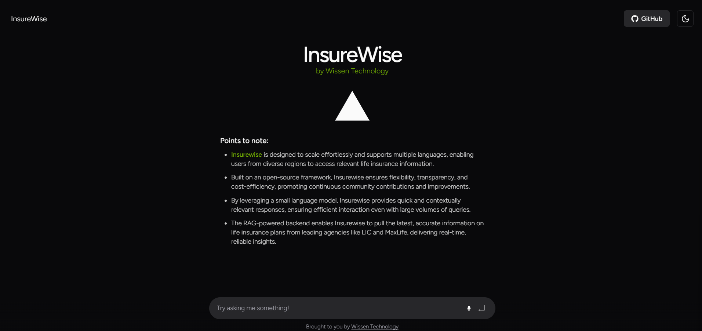

# InsureWise Chatbot

InsureWise is a scalable, multilingual chatbot designed to deliver real-time, reliable insights on life insurance information. By leveraging efficient models and retrieval-augmented generation (RAG), InsureWise ensures users get the most accurate, context-aware responses about insurance policies from leading agencies like LIC and MaxLife.

## Table of Contents

- [Introduction](#introduction)
- [Context](#context)
- [Features](#features)
- [Tech Stack](#tech-stack)
- [Quickstart](#quickstart)
  - [Frontend](#frontend)
  - [Backend](#backend)
- [Usage](#usage)
- [Contributing](#contributing)
- [License](#license)
- 

## Introduction

InsureWise is built on an open-source framework that emphasizes flexibility, transparency, and cost-efficiency. Its design enables effortless scalability and multilingual support, ensuring users from diverse regions have access to accurate and up-to-date life insurance information. With an efficient small language model and a robust RAG-powered backend, InsureWise is poised to handle large volumes of queries while maintaining high accuracy.



## Context

- **Scalable and Multilingual:**  
  InsureWise supports multiple languages, allowing users worldwide to access localized life insurance information.

- **Open-Source Framework:**  
  The framework promotes transparency, flexibility, and continuous community contributions, ensuring that the system remains up-to-date and adaptable.

- **Efficient Response Generation:**  
  Leveraging a small language model (Mistral), InsureWise delivers quick, contextually relevant responses even during high-load scenarios.

- **Retrieval-Augmented Generation (RAG):**  
  The backend integrates RAG to fetch the latest information from major insurance providers such as LIC and MaxLife, ensuring that users receive accurate and real-time insights.

## Features

1. **Enriched Information Retrieval from RAG:**  
   - Provides correct and detailed information on life insurance policies in real time.
   - Guides users on where to find relevant documents with high accuracy.

2. **Multilingual Support:**  
   - Caters to a global audience by supporting multiple languages.

3. **Voice Interaction:**  
   - Enables users to interact with the chatbot using voice commands for a hands-free experience.

4. **Contextual Conversational Analysis:**  
   - Maintains conversation context for more natural and intuitive interactions.

5. **User-Friendly Interface:**  
   - Offers a simple and crisp UI with options for dark and light mode to enhance usability.

## Tech Stack

- **Backend:**
  - **Language:** Python
  - **Models:**  
    - Small language model: **Mistral**
    - Embedded model: **nomic-embed-text-v1**
  - **Approach:** Retrieval-Augmented Generation (RAG)
- **Frontend:**
  - **Framework:** Next.js
  - **Package Manager/Dev Server:** Bun
- **Others:**  
  Open-source principles ensuring transparency and continuous community improvement.

## Quickstart

### Frontend
1. **Install Dependencies:**
   ```bash
   bun install
   ```
2. **Run the Development Server:**
   ```bash
   bun dev
   ```

### Backend
1. **Clone the Backend repo:**
   ```bash
   git clone https://github.com/yashsinghal2004/hackathon-backend.git
   ```
2. **Setup Environment:**
   - **Set Up Ollama Service:**
     - #### macOS
       - **Install via Homebrew (Recommended):**
         ```bash
         brew install ollama
         ```
       - **Manual Installation:**  
         - Download the latest `.pkg` file from [Ollama’s official website](https://ollama.com).
         - Open the downloaded file and follow the installation prompts.
       - **Verify Installation:**
         ```bash
         ollama --version
         ```
     - #### Linux (Debian/Ubuntu)
       - **Install using `.deb` package:**
         ```bash
         curl -fsSL https://ollama.com/install.sh | sh
         ```
       - **Manual Installation:**  
         - Download the `.deb` package from [Ollama’s official website](https://ollama.com).
         - Install the package using:
           ```bash
           sudo dpkg -i ollama-<version>.deb
           sudo apt-get install -f  # Fix dependencies if needed
           ```
       - **Verify Installation:**
         ```bash
         ollama --version
         ```
     - #### Windows
       - **Install via MSI Installer:**  
         - Download the latest `.msi` installer from [Ollama’s official website](https://ollama.com).
         - Run the installer and follow the setup instructions.
       - **Install via Windows Package Manager (winget):**
         ```bash
         winget install ollama
         ```
       - **Verify Installation:**  
         Open PowerShell or Command Prompt and run:
         ```bash
         ollama --version
         ```
   - **Set Up a Virtual Environment:**
     - **macOS/Linux:**
       ```bash
       python3 -m venv venv
       source venv/bin/activate
       ```
     - **Windows:**
       ```bash
       python -m venv venv
       venv\Scripts\activate
       ```

3. **Install Required Python Packages:**
   ```bash
   pip install -r requirements.txt
   ```

4. **Start the Translation Server (in a Separate Terminal Window):**
   In order to enable ***multilingual support***, open a **separate terminal window** and perform the following:
   - **Activate the Virtual Environment:**
     - **macOS/Linux:**
       ```bash
       source venv/bin/activate
       ```
     - **Windows:**
       ```bash
       venv\Scripts\activate
       ```
   - **Install Requirements (if not already installed):**
     ```bash
     pip install -r requirements.txt
     ```
   - **Run the Translation Server:**
     ```bash
     python translate_server.py
     ```

5. **Run the Backend Server:**
   In your original terminal (with the virtual environment activated), start the main backend server:
   ```bash
   python3 app.py
   ```

## Usage

Once both the frontend and backend servers are running, open your browser and navigate to [http://localhost:3000](http://localhost:3000) (or your designated port). Interact with the chatbot using text or voice commands to receive real-time, context-aware responses about various life insurance policies.

## Contributing

Contributions are welcome! Please follow these steps to contribute:

1. Fork the repository.
2. Create a new branch (`git checkout -b feature/YourFeature`).
3. Commit your changes (`git commit -m 'Add YourFeature'`).
4. Push the branch (`git push origin feature/YourFeature`).
5. Open a Pull Request detailing your changes.

For major changes, please open an issue first to discuss your proposed changes.

## 📄 License

MIT License © 2025 [Yash Singhal]

"# hackathon-frontend" 
